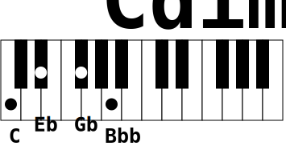

# showchord
Show chords on a piano keyboard to see how to play it.

From notes, showchord produces SVG image files representing a two-scaled keyboard with marks on it.

## Features

  * Draw an empty 2 octaves piano keyboard - eventually with a title - SVG output format
  * Draw any chord you can imagine (on a 2 octave keyboard) by giving note names. The chord is represented by round marks on the keys
  * Print a title above the keyboard
  * Print note names below the marked keys
  * Export to bitmap (PNG) file (by default, resulting is stored in SVG files)
  * Force output filename prefix
  * Provide zoom value to change the drawing size
  * Generate many chords at once from informations taken from a stream

## Examples, documentation and more

http://kkwoin.hd.free.fr/showchord

