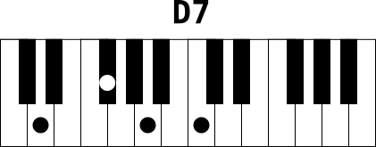

# showchord
Drawing a chord on a piano keyboard to show how to play it.


## Motivation
As you play keyboard by auto-learning and do not have music theory skills (you can not read scores), you may need to draw a chord as marks on a keyboard to see how to play it. Showchord is a program to help doing that. It renders chord drawings as SVG and PNG images.

As I once was talking to a friend of piano chord positions, I could not find any program to help me generate these little piano chord pictures, so I wrote showchord. Then I could compose [this triads document](examples/triads.pdf) to help my friend learn basic chords.

The idea behind showchord is to be able to automate piano chord drawings from few information: the notes of the chords.

I hope showchord could be useful to others. You may use it to write a piano method for example.

Please let me know if you use it and tell me if you find it easy (or not) to use :-)

## Development
Showchord was first written in shell (bash) but I found very difficult to describe note structure clearly with shell. Then I switched to python for its rich types. I also choosed python among other languages to learn it.

My goal is to make showchord a usable tool in Linux CLI point of view, to make it possible to write scripts generating documents with chord representations. I also want to keep programing style as clear as possible to make code evolutions easy.

### Depencies
1. Python modules (mandatory)
    - os
    - sys
    - subprocess
    - argparse
    - collections (namedtuple)

2. External programs (optional, only required for bitmap export)
    - [Inkscape](https://inkscape.org/) is needed to transform SVG to PNG with --export option
    - If you are running Linux and do not want to install Inkscape, then consider using [librsvg](https://wiki.gnome.org/Projects/LibRsvg) instead, for exporting (rsvg-export command line tool)

Note : you do not need any external program to generate SVG images

## Features

  * Draw an empty 2 octaves keyboard - eventually with a title - SVG output format
  * Draw any chord you can imaging (on a 2 octave keyboard) by giving notes name. The chord is represented by round marks on the keys
  * Print a title above the keyboard
  * Print note names below the marked keys
  * Export to bitmap (PNG) file (by default, resulting SVG file is written on stdout)
  * Force output filename
  * Provide zoom value to change the drawing size
  * Generate many chords at once from informations taken from a stream (stream mode)


## Examples of use

### Basic
The most basic usage of showchord is without any argument. This produces a two scales keyboard whithout any mark or title.
```bash
showchord
```
The result on standart output is the equivalent of this [basic.svg](examples/basic.svg) file.


Another more common basic usage is with `--chord` (`-c`) option:
```bash
showchord --chord "C E G B"
```
That prints an SVG file content on standart output, representing a 2 scales piano keyboard with marks on the keys of the chord notes:
[basic_cmaj7.svg](examples/basic_cmaj7.svg)

### Redirect to file
To put this output into a file, use system redirection
```bash
showchord --chord "C E G B" > c_maj7.svg
```
This creates the SVG file [c_maj.svg](examples/c_maj7.svg)

From now you can visualize the chord in a modern browser by pointing to the URL `file:///path-to-my-chord/c_maj7.svg`


If you have `inkscape` installed on your system, you probably have `inkview` tool too. Both allow you to view SVG files.
```bash
inkview c_maj7.svg         # view svg file in an X window
```

If you are running Linux, you may also consider using [librsvg](https://wiki.gnome.org/Projects/LibRsvg) and its `rsvg-view-3` command line tool.
```bash
rsvg-view-3 c_maj7.svg     # view svg file in an X window
```

### Export to PNG
You may prefer to have bitmap images instead of svg files. For this reason it is possible to export the result SVG file to PNG raster image with `--export` (`-e`) option
```
showchord --export -c "C E G B"
```
This example produces automatically SVG (`C-E-G-B.svg`) and PNG (`C-E-G-B.png`) files:

[C-E-G-B.svg](examples/C-E-G-B.svg)


### Chord name

You may need to name the chord, you can do it with `-n` (`--chordname`) option
```
showchord -c "C E G B" --chordname "Cmaj7" -f cmaj7 -e
```
This creates both SVG and PNG files:

[cmaj7.svg](examples/cmaj7.svg)


### Notes name

If you need notes name to appear below the keyboard, then use the `-p` (`--printkey`) option
```
showchord -c "C E G B" --chordname "Cmaj7" -f c-maj7 -e --printkey
```
This creates both SVG and PNG files:

[c-maj7.svg](examples/c-maj7.svg)


### Zoom

The default size of a chord drawing can be modified with the `--zoom` option. This is not very useful with SVG file as svg drawings can be resized without quality loss, but the raster images may look ugly if zoomed with an image viewer. The `--zoom` option takes a float number, 1.0 being the default value.

Let's try 3 different sizes of the same chord, zoom values 1.0, 3.0 and 5.0
```
for i in 1 3 5 ; do showchord -c "D F# A C" -f "d7-zoom-$i" --zoom $i -n "D7" -e ;done
```
The result images are the following:

`--zoom 1.0` : 

`--zoom 3.0` : 

`--zoom 5.0` : 


### Stream input

You may want to prepare many chords in a text file and draw them in one shot. The `-s` (`--stream`) option allows you to read chords from a file and draw one chord per row.

A row must be of the form `chord;chordname` e.g: `C E G B;Cmaj7`.

Say we have the file `minor-chords-1.txt` containing minor chords at root position:

```
cat examples/stream/minor-chords-1.txt
C Eb G;Cm
C# E G#;C#m
Db E Ab;Dbm
D F A;Dm
D# F# A#;D#m
Eb Gb Bb;Ebm
E G B;Em
F Ab C;Fm
F# A C#;F#m
Gb A Db;Gbm
G Bb D;Gm
G# B D#;G#m
Ab B Eb;Abm
A C E;Am
A# C# F;A#m
Bb Db F;Bbm
B D F#;Bm
```

To generate the drawing of each chords, we use the following command:

```
showchord -e -p -s < minor-chords-1.txt
```

And we obtain the following files:

SVG files

[examples/stream/minor/Cm.svg](examples/stream/minor/Cm.svg)

[examples/stream/minor/Csharpm.svg](examples/stream/minor/Csharpm.svg)

[examples/stream/minor/Dm.svg](examples/stream/minor/Dm.svg)

[examples/stream/minor/Dsharpm.svg](examples/stream/minor/Dsharpm.svg)

[examples/stream/minor/Em.svg](examples/stream/minor/Em.svg)

[examples/stream/minor/Fm.svg](examples/stream/minor/Fm.svg)

[examples/stream/minor/Fsharpm.svg](examples/stream/minor/Fsharpm.svg)

[examples/stream/minor/Gm.svg](examples/stream/minor/Gm.svg)

[examples/stream/minor/Gsharpm.svg](examples/stream/minor/Gsharpm.svg)

[examples/stream/minor/Am.svg](examples/stream/minor/Am.svg)

[examples/stream/minor/Asharpm.svg](examples/stream/minor/Asharpm.svg)

[examples/stream/minor/Bm.svg](examples/stream/minor/Bm.svg)


PNG files


