# showchord
Show chords on a piano keyboard to see how to play it.

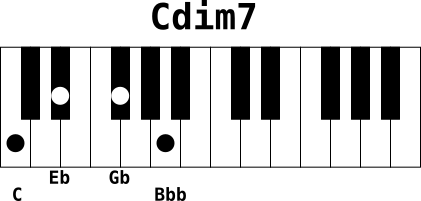

## Motivation
As you play keyboard by auto-learning and do not have enough music theory skills to read scores, you may need to draw chord as marks on a keyboard to see how to play it. Showchord is a program to help doing that. It renders chord drawings as SVG and PNG images.

As I once was talking to a friend of piano chord positions, I could not find any program to help me generate these little piano chord pictures, so I wrote showchord. Then I could compose [this triads document](examples/triads.pdf) to help my friend learn really basic chords.

The idea behind showchord is to be able to automate piano chord drawings from few information: the notes of the chords.

I hope showchord could be useful to others. You can use it to write a piano method for example.

Please let me know if you use it and tell me if you find it easy (or not) to use :-)

## Development
Showchord was first written in shell (bash) but I found very difficult to describe note structure clearly with shell. Then I switched to python for its rich types. I also choosed python among other languages to learn it.

My goal is to make showchord a usable tool in Linux CLI point of view, to make it possible to write scripts generating documents with chord representations. I also want to keep programing style as clear as possible to make code evolutions easy.

### Depencies
1. Python modules (mandatory)
    - os
    - sys
    - subprocess
    - argparse
    - collections (namedtuple)

2. External programs (optional, only required for bitmap export)
    - [Inkscape](https://inkscape.org/) is needed to transform SVG to PNG with --export option
    - If you are running Linux and do not want to install Inkscape, then consider using [librsvg](https://wiki.gnome.org/Projects/LibRsvg) instead, for exporting (rsvg-export command line tool)

Note : you do not need any external program to generate SVG images

## Features

  * Draw an empty 2 octaves piano keyboard - eventually with a title - SVG output format
  * Draw any chord you can imagine (on a 2 octave keyboard) by giving note names. The chord is represented by round marks on the keys
  * Print a title above the keyboard
  * Print note names below the marked keys
  * Export to bitmap (PNG) file (by default, resulting is stored in SVG files)
  * Force output filename prefix
  * Provide zoom value to change the drawing size
  * Generate many chords at once from informations taken from a stream


## Examples of use

### Preamble

You can visualize SVG files in a modern browser by pointing to the URL `file:///path-to-my-file/my_svg_file.svg`

If you have `inkscape` installed on your system, you probably have `inkview` tool too. Both allow you to view SVG files.
```bash
inkview my_svg_file.svg         # view svg file in an X window
```

If you are running Linux, you may also consider using `librsvg` and its `rsvg-view-3` command line tool.
```bash
rsvg-view-3 my_svg_file.svg     # view svg file in an X window
```


### Basic
The most basic usage of showchord is with an empty string as argument. This produces a two scales keyboard without any mark or title.
```bash
showchord ''
```
The result is the SVG file [chord_0.svg](examples/chord_0.svg).

Another more common basic usage is with a chord description:
```bash
showchord 'C E G B'
```
As before, that makes an SVG file representing a 2 scales piano keyboard with marks on the keys of the chord notes. The output file has the same automatic name as before (chord_0.svg):
[basic_chord_0.svg](examples/basic_chord_0.svg)

### Change fileprefix
To change the automatic filename you can choose a specific prefix, use `--fileprefix` (`-f`) option:
```bash
showchord 'C E G B' 'F A C E' --fileprefix maj7_
```
This creates two SVG files [maj7_0.svg](examples/maj7_0.svg) and [maj7_1.svg](examples/maj7_1.svg)

### Export to PNG
You may prefer to have bitmap images instead of svg files. For this reason it is possible to export the result SVG file to PNG raster image with `--export` (`-e`) option:
```
showchord --export 'C E G B' -f export_
```
This example produces automatically SVG (`export_0.svg`) and PNG (`export_0.png`) files:

[export_0.svg](examples/export_0.svg)


### Chord name

You may need to name the chord, you can do it with directly after the chord description:
```
showchord 'C E G B;Cmaj7' -e
```
This creates both SVG and PNG files:

[chord_cmaj7_0.svg](examples/chord_cmaj7_0.svg)


### Notes name

If you need notes name to appear below the keyboard, then use the `-k` (`--keyprint`) option
```
showchord 'C E G B;Cmaj7' -e --keyprint -f keyprint_
```
This creates both SVG and PNG files:

[keyprint_cmaj7_0.svg](examples/keyprint_cmaj7_0.svg)

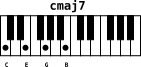

### Zoom

The default size of a chord drawing can be modified with the `--zoom` option. This is not very useful with SVG file as svg drawings can be resized without quality loss, but the raster images may look ugly if zoomed with an image viewer. The `--zoom` option takes a float number, 1.0 being the default value.

Let's try 3 different sizes of the same chord, zoom values 1.0, 3.0 and 5.0
```
for i in 1 3 5 ; do showchord 'c Eb Gb Bbb;Cdim7' -e -k -f zoom_${i}_ --zoom $i ; done
```
The result images are the following:

`--zoom 1.0` : 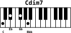

`--zoom 3.0` : 

`--zoom 5.0` : 


### Stream input

Stream input is the natural mode for providing chords. You can provide as many chords as you like in a single call. However, you may want to prepare many chords in a text file and draw them at once. You can use system redirection to achieve this.

**Note**: You must **not** provide chords in command line for input stream to work

A line in the file must be of the form `chord;chordname` e.g: `C E G B;Cmaj7`.

Say we have the file `minor-chords-1.txt` containing minor chords at root position:

```
cat examples/stream/minor-chords-1.txt
C Eb G;Cm
C# E G#;C#m
Db E Ab;Dbm
D F A;Dm
D# F# A#;D#m
Eb Gb Bb;Ebm
E G B;Em
F Ab C;Fm
F# A C#;F#m
Gb A Db;Gbm
G Bb D;Gm
G# B D#;G#m
Ab B Eb;Abm
A C E;Am
A# C# F;A#m
Bb Db F;Bbm
B D F#;Bm
```

To generate the drawings of each chords with --keyprint, --export and --zoom 2.0 options, we use the following command:

```
showchord -e -k -z 2 < minor-chords-1.txt
```

And we obtain the following result stored in SVG and PNG files:


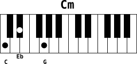  [examples/stream/minor/chord_Cm_0.svg](examples/stream/minor/chord_Cm_0.svg)

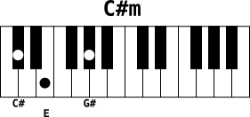  [examples/stream/minor/chord_Csm_1.svg](examples/stream/minor/chord_Csm_1.svg)

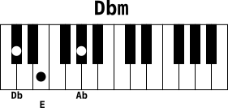  [examples/stream/minor/chord_Dbm_2.svg](examples/stream/minor/chord_Dbm_2.svg)

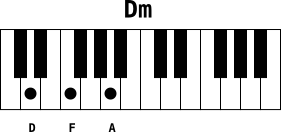  [examples/stream/minor/chord_Dm_3.svg](examples/stream/minor/chord_Dm_3.svg)

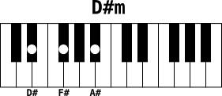  [examples/stream/minor/chord_Dsm_4.svg](examples/stream/minor/chord_Dsm_4.svg)

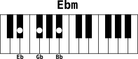  [examples/stream/minor/chord_Ebm_5.svg](examples/stream/minor/chord_Ebm_5.svg)

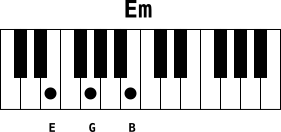  [examples/stream/minor/chord_Em_6.svg](examples/stream/minor/chord_Em_6.svg)

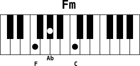  [examples/stream/minor/chord_Fm_7.svg](examples/stream/minor/chord_Fm_7.svg)

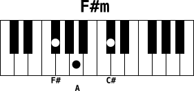  [examples/stream/minor/chord_Fsm_8.svg](examples/stream/minor/chord_Fsm_8.svg)

  [examples/stream/minor/chord_Gbm_9.svg](examples/stream/minor/chord_Gbm_9.svg)

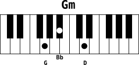  [examples/stream/minor/chord_Gm_10.svg](examples/stream/minor/chord_Gm_10.svg)

  [examples/stream/minor/chord_Gsm_11.svg](examples/stream/minor/chord_Gsm_11.svg)

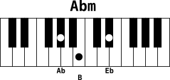  [examples/stream/minor/chord_Abm_12.svg](examples/stream/minor/chord_Abm_12.svg)

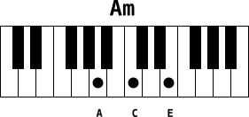  [examples/stream/minor/chord_Am_13.svg](examples/stream/minor/chord_Am_13.svg)

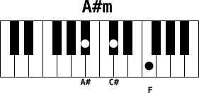  [examples/stream/minor/chord_Asm_14.svg](examples/stream/minor/chord_Asm_14.svg)

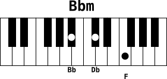  [examples/stream/minor/chord_Bbm_15.svg](examples/stream/minor/chord_Bbm_15.svg)

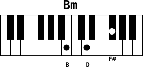  [examples/stream/minor/chord_Bm_16.svg](examples/stream/minor/chord_Bm_16.svg)

