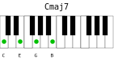

# pianochords
Drawing a piano keyboard with chord positions.



## Motivation
As you play keyboard by auto-learning and do not have music theory skills (you can not read scores), you may need to draw chords positions on a keyboard. Pianochords is a program to help doing that work and render as SVG and PNG.

## Development
Pianochords is developed with python3. I'm quite new with this language so the programing style might be poor. 
My goal is first to make pianochords a usable tool in Linux CLI point of view. The idea behind it is to be able to automate piano chord drawings from few information: the notes of the chord.

### Depencies
1. Python modules
    - sys
    - subprocess
    - collections (namedtuple)
    - optparse (OptionParser)
    - contextlib (redirect_stdout)
2. External programs
    - [Inkscape](https://inkscape.org/) is needed to transform SVG to PNG with --export option
    - If you are running Linux and do not want to install Inkscape, then consider using [librsvg](https://wiki.gnome.org/Projects/LibRsvg) instead, for exporting (rsvg-export command line tool)

## Features


## Examples of use

Basic usage is:
```bash
pianochords --chord "C E G B"
```
That will print an SVG file content on standart output.

To put this output into a file, use system redirection
```bash
pianochords --chord "C E G B" > C_MAJ7.svg
```

From now you can visualize the chord in a modern browser by pointing to the URL `file:///path-to-my-chord/C_MAJ7.svg`
If you have `inkscape` installed on your system, you probably have `inkview` tool too. Both allow you to view SVG files.
```bash
inkview C_MAJ7.svg         # view svg file in an X window
```

If you are running Linux, you may also consider using [librsvg](https://wiki.gnome.org/Projects/LibRsvg) and its `rsvg-view-3` command line tool.
```bash
rsvg-view-3 C_MAJ7.svg     # view svg file in an X window
```
