# pianochords
Drawing a piano keyboard with chord positions.

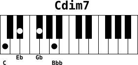

## Motivation
As you play keyboard by auto-learning and do not have music theory skills (you can not read scores), you may need to draw chords positions on a keyboard. Pianochords is a program to help doing that work and render as SVG and PNG.

## Development
Pianochords is developed with python3. I'm quite new with this language so the programing style might be poor. 
My goal is first to make pianochords a usable tool in Linux CLI point of view. The idea behind it is to be able to automate piano chord drawings from few information: the notes of the chord.

### Depencies
1. Python modules
    - sys
    - subprocess
    - collections (namedtuple)
    - optparse (OptionParser)
    - contextlib (redirect_stdout)
2. External programs
    - [Inkscape](https://inkscape.org/) is needed to transform SVG to PNG with --export option
    - If you are running Linux and do not want to install Inkscape, then consider using [librsvg](https://wiki.gnome.org/Projects/LibRsvg) instead, for exporting (rsvg-export command line tool)

## Features


## Examples of use

Basic usage is:
```bash
pianochords --chord "C E G B"
```
That will print an SVG file content on standart output, representing a 2 scales piano keyboard with marks on the keys of the chord notes:
[basic.svg](examples/basic.svg)

To put this output into a file, use system redirection
```bash
pianochords --chord "C E G B" > C_MAJ7.svg
```
This creates the SVG file [C_MAJ7.svg](examples/C_MAJ7.svg)

From now you can visualize the chord in a modern browser by pointing to the URL `file:///path-to-my-chord/C_MAJ7.svg`
If you have `inkscape` installed on your system, you probably have `inkview` tool too. Both allow you to view SVG files.
```bash
inkview C_MAJ7.svg         # view svg file in an X window
```

If you are running Linux, you may also consider using [librsvg](https://wiki.gnome.org/Projects/LibRsvg) and its `rsvg-view-3` command line tool.
```bash
rsvg-view-3 C_MAJ7.svg     # view svg file in an X window
```

As most word processor prefer bitmap images to svg files, it is possible to export the result SVG file to PNG raster image with `-e` (`--export`) option
```
pianochords --export -c "C E G B"
```
This example produces automatically SVG (`C-E-G-B.svg`) and PNG (`C-E-G-B.png`) files:

[C-E-G-B.svg](examples/C-E-G-B.svg)

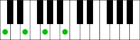

You may need to name the chord, you can do it with `-n` (`--chordname`) option
```
pianochords -c "C E G B" --chordname "Cmaj7" -f cmaj7 -e
```
This creates both SVG and PNG files:

[cmaj7.svg](examples/cmaj7.svg)

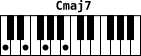

If you need notes name to appear below the keybord, then use the `-p` (`--printkey`) option
```
pianochords -c "C E G B" --chordname "Cmaj7" -f c_maj7 -e
```
This creates both SVG and PNG files:

[c_maj7.svg](examples/c_maj7.svg)

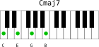

You may want to prepare many chords in text file and draw them in one shot. The `-s` (`--stream`) option allows you to read chords from a file and draw one chord per row.

A row must be of the form `chord;chordname` e.g: `C E G B;Cmaj7`.

Say we have the file `minor-chords-1.txt` containing minor chords at root position:

```
cat examples/stream/minor-chords-1.txt
C Eb G;Cm
C# E G#;C#m
Db E Ab;Dbm
D F A;Dm
D# F# A#;D#m
Eb Gb Bb;Ebm
E G B;Em
F Ab C;Fm
F# A C#;F#m
Gb A Db;Gbm
G Bb D;Gm
G# B D#;G#m
Ab B Eb;Abm
A C E;Am
A# C# F;A#m
Bb Db F;Bbm
B D F#;Bm
```

To generate the drawing of each chords, we use the following command:

```
pianochords -e -p -s < minor-chords-1.txt
```

And we obtain the following files:

SVG files

[examples/stream/minor/Cm.svg](examples/stream/minor/Cm.svg)

[examples/stream/minor/Csharpm.svg](examples/stream/minor/Csharpm.svg)

[examples/stream/minor/Dm.svg](examples/stream/minor/Dm.svg)

[examples/stream/minor/Dsharpm.svg](examples/stream/minor/Dsharpm.svg)

[examples/stream/minor/Em.svg](examples/stream/minor/Em.svg)

[examples/stream/minor/Fm.svg](examples/stream/minor/Fm.svg)

[examples/stream/minor/Fsharpm.svg](examples/stream/minor/Fsharpm.svg)

[examples/stream/minor/Gm.svg](examples/stream/minor/Gm.svg)

[examples/stream/minor/Gsharpm.svg](examples/stream/minor/Gsharpm.svg)

[examples/stream/minor/Am.svg](examples/stream/minor/Am.svg)

[examples/stream/minor/Asharpm.svg](examples/stream/minor/Asharpm.svg)

[examples/stream/minor/Bm.svg](examples/stream/minor/Bm.svg)


PNG files

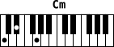

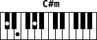

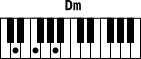

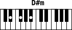

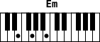

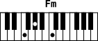

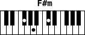

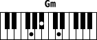

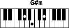

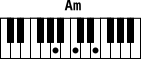

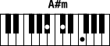

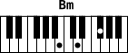


